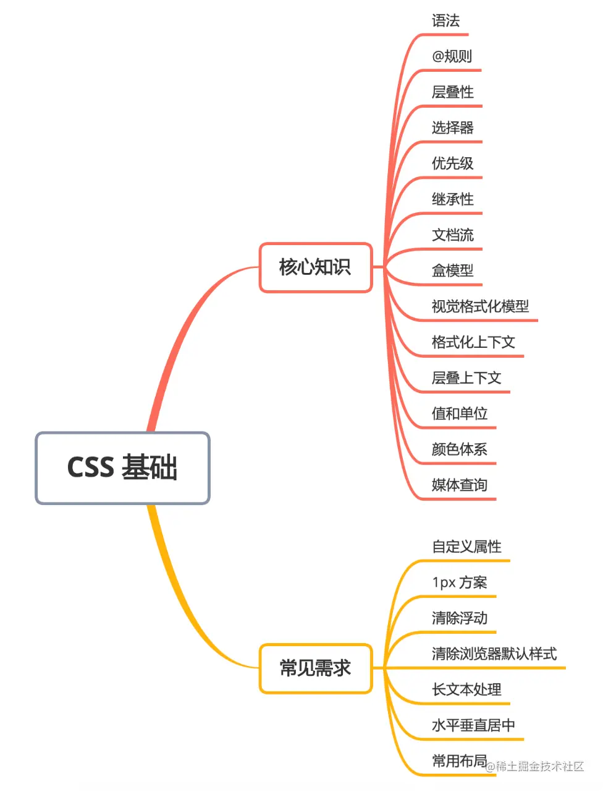
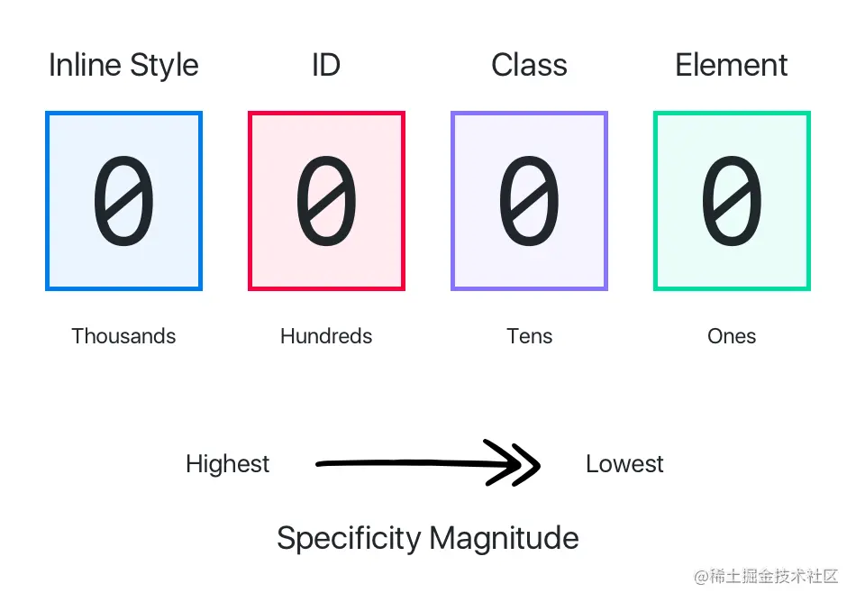

# CSS基础


## @规则
CSS规则是样式表的主题，通常样式表会包括大量的规则表。但有时候也需要在样式表中包括其他的一些信息，导入其他的外部样式表，字体等，这些需要专门的语句表示
::: tips 常用
而 @规则 就是这样的语句，CSS里包含了一下 @规则
* @namespace 告诉CSS引擎必须考虑XML命名空间。
* @media 如果满足媒体查询的条件则条件规则组里的规则生效
* @page 描述打印文档时布局的变化
* @font-face 描述讲下载的外部的字体
* @keyframes 描述CSS动画的关键帧
* @document 如果文档样式表满足条件则条件规则组里的规则生效
:::

### @charset 用于定义样式表使用的字符集，必须是样式表中的第一个元素。
如果有多个@charset被声明，只有第一个会被使用，而且不能在HTML元素或HTML页面`<style>`元素使用
注意： 值必须是双引号包裹
```css
@charset "UTF-8";
```
默认的识别规则
* 文件开头的Byte order mark字符值 BOM
* HTTP响应头里的`COntent-Type`字段包含`charset`所指定的值
```
Content-Type: text/css; charset=utf-8
```
* CSS文件头里定义的@charset规则里指定的字符编码
* `link` 标签里的charset属性（HTML5已经废除）
* 默认是 `UTF-8`

### @import
用于告诉CSS引擎引入一个外部样式表。

:::tips 问题1
link和@import都能导入一个样式文件，它们有什么区别嘛
* link 是 HTML标签，除了能导入CSS外，还能导入别的资源，比如图片 脚本 和字体等；而@import是CSS的语法，只能用来导入CSS；
* link导入的样式会在页面加载时同时加载，@import导入的样式需等页面加载完成后再加载
* link没有兼容性问题，@import不兼容ie5以下
* link可以通过JS操作DOM动态引入样式表改变样式，@import不能
:::

### @supports
用于查询特定的CSS是否生效，可以接合not，and和or操作符进行后续操作
```css
/* 如果支持自定义属性，则把body颜色设置为变量varName 指定的颜色*/
@supports (--varName: #FFE) {
  body {
    color: var(--varName);
  }
}
```

## 选择器
### 基础选择器
* 标签选择器 `h1`
* 类选择器 `.checked`
* ID选择器 `#picker`
* 通配符选择器 `*`

#### 属性选择器
* `[attr]` 指定属性的元素
* `[attr=val]` 属性值等于指定值的元素
* `[attr*=val]` 属性包含指定值的元素
* `[attr^=val]` 属性以指定值开头的元素
* `[attr$=val]` 属性以指定值结尾的元素
* `[attr~=val]` 属性包含指定值（完整单词）的元素(不推荐)
* `[attr|=val]` 属性以指定值（完整单词）开头的元素(不推荐)

#### 组合选择器
* 相邻兄弟选择器 `A+B`
* 普通兄弟选择器 `A ~ B`
* 子选择器 `A > B`
* 后代选择器 `A B`

### 伪类
#### 条件伪类
* `:lang()` 基于元素语言来匹配页面元素
*  `:dir()` 匹配特定文字书写方向的元素
* `:has()` 匹配包含指定元素的元素
* `:is()` 匹配指定选择器列表里的元素
* `:not()` 匹配不符合一组选择器的元素

#### 行为伪类
* `:active` 鼠标激活的元素
* `:hover` 鼠标悬浮的元素
* `::selection` 鼠标选中的元素

#### 状态伪类
* `:target` 当前锚点的元素
* `:link` 未访问的链接元素
* `:visited` 已访问的链接元素
* `:focus` 输入聚焦的表单元素
* `:required` 输入必填的表单元素
* `:valid` 输入合法的表单元素
* `:invalid` 输入非法的表单元素
* `:in-range` 输入范围内的表单元素
* `:out-of-range` 输入范围外的表单元素
* `:checked` 选项选中的表单元素
* `:optional` 选项可选的表单元素
* `:enabled` 事件启用的表单元素
* `:disabled` 事件禁用的表单元素
* `:read-only` 只读的表单元素
* `:read-write` 可读可写的表单元素
* `:blank` 输入为空的表单元素
* `:current()` 浏览中的元素
* `:past()` 已浏览的元素
* `:future()` 未浏览的元素

#### 结构伪类
* `:root` 文档的根元素
* `:empty` 无子元素的元素
* `:first-letter` 元素的首字母
* `:first-line` 元素的首行
* `:nth-child(n)` 元素中指定元素顺序索引的元素
* `:nth-last-child(n)` 元素中指定逆序索引的元素
* `:first-child` 元素中为首的元素
* `:last-child` 元素中为尾的元素
* `:only-child` 父元素仅有该元素的元素
* `:nth-of-type(n)` 标签中指定顺序索引的标签
* `:nth-last-of-type(n)` 标签中指定逆序索引的标签
* `:first-of-type` 标签中为首的标签a
* `:last-of-type` 标签中为尾的标签
* `:only-of-type` 父元素仅有该标签的标签

### 伪元素
* `::before` 在元素前插入内容
* `::after` 在元素后插入内容

#### 优先级


优先级就是分配给指定CSS声明的一个权重，它由匹配的选择器中的每一个选择器类型的数值决定，为了记忆，可以把权重分成如下几个等级，数值越大的权重越高

* 10000: !important
* 01000: 内联样式
* 00100: ID选择器
* 00010: 类选择器、伪类选择器、属性选择器
* 00001: 元素选择器、伪元素选择器
* 00000: 通配符、后代/兄弟选择器

可以看到内联样式(通过元素中style属性定义的样式)的优先级大雨任何选择器；而给属性值加上`!important` 又可以吧优先级提升至最高，就是因为它的优先级最高，所以需要谨慎使用它
> * 一定要优先考虑使用样式规则的优先级来解决问题 而非!important
> * 只有在需要覆盖全站或者外部CSS的特定页面中使用 !important
> * 永远不要在插件中使用，不要在全站范围的CSS代码中使用

## 继承性