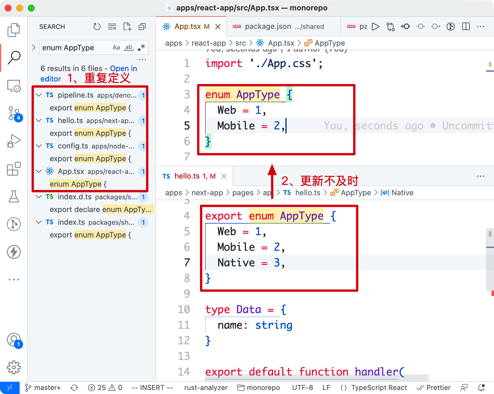
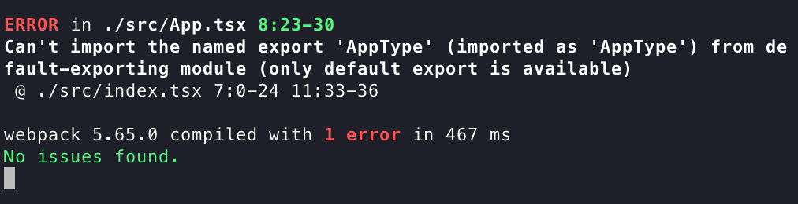
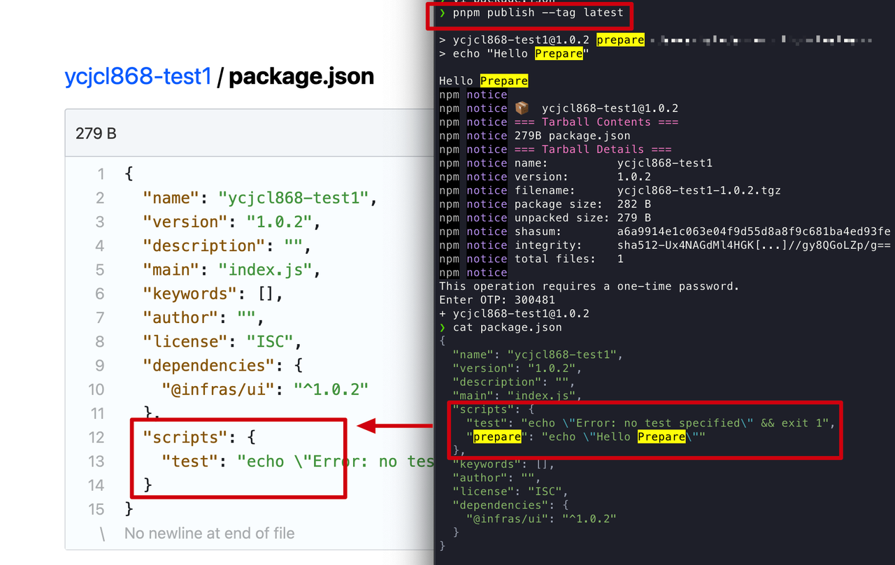
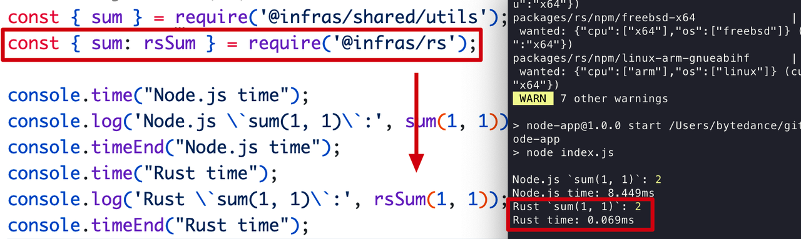

# Monorepo 下的模块包设计实践
> ref: [https://www.rustc.cloud/monorepo-pkg](https://www.rustc.cloud/monorepo-pkg)

<!-- [[toc]] -->

## 前言
本文主要面向业务中使用**Monorepo**组织**应用和模块**，抛砖引玉探讨下：
* 怎样设计一个**共享配置包**（配置、类型、utils、枚举），同时在前端、Node.js、Vite 等项目中使用
* ~~组件库 UI 模块（packages/ui）~~
* ~~原生语言模块（packages/native）~~

原文演示的代码仓库见：[monorepo](https://github.com/ycjcl868/monorepo)（使用 pnpm，其它 Monorepo 工具同理）

## 为什么设计模块包？
随着**Monorepo**代码越堆越多、多人员协作情况下，不可避免遇到如下问题：
* __重复定义问题__：工具方法、类型、配置在不同应用之间**重复定义**，维护困难。（例如：一个应用类型`AppType`的定义可以达*10多处*，很多还是*旧的定义*；项目用到配置；`tsconfig.json` 、prettier 等相同的配置写一遍又一遍）
  


* __依赖管理问题__：为解决重用问题，我们也试过将模块先发成 npm 包，但发完需要**更新**应用 package.json 中的**依赖版本**，一来一回非常折腾。

* __跨项目使用问题__：同构就是指 **模块同时跑在前后端项目**，兼容不同的**模块包规范**（CommonJS、ESM 等）。如果没有很好的设计包结构，经常会在项目**编译打包时报错** ❌。



## 有哪些类型的模块包？
由于历史原因，JavaScript 模块化系统一直没有统一规范，大致发展过程是：CJS →  AMD →  CMD →  UMD →  ESM，这给设计一个**跨应用使用的模块**带来不少麻烦。
在设计模块包之前，有必要先了解下目前主流的模块类型和规范（esm、cjs、umd）。

:::tip ESM（ES Modules）
JavaScript 官方的标准化模块系统（草案），在标准化道路上花了近 10 年时间。 
适用于：
* Browser
* Node.js ≥ 12.17
#### 导出语法 && 使用语法
```jsx
export default foo
export const foo = 1;
export { bar as foo } from ''

import foo from 'name'
import { foo } from 'name'
import { foo as bar } from 'name'
<script type="module" src="."></script>
<script type="module">
import { bar } from 'name';
</script>
```
JS 标准，优先考虑使用该模块 Tree Shaking 友好
:::

:::tip CJS（CommonJS）
Node.js 的模块标准，文件即模块。
适用于：
* Node.js
#### 导出语法 && 使用语法
```js
module.exports = foo
exports.foo = 1;
const foo = require('name');
const { foo } = require('name');
```
对 Tree Shaking 不友好 前端也可以使用 cjs 格式，依靠构建工具（webpack / rollup 等）
:::

:::tip UMD（Universal Module Definition）
umd 严格意义上不算规范，只是社区出的通用包模块结合体的格式，兼容 CJS 和 AMD 格式。
浏览器端用来挂载全局变量 （如：window.*）
适用于：
* Browser（external 场景）
* Node.js（较少）
#### 导出语法 && 使用语法
```js
(function (root, factory) {
 if (// amd) {
  } else if (//cjs) {
  } else (//global)  {
  }
})(this, function() {})
window.React
window.ReactDOM
```
:::

通过上面模块的对比，对于现阶段选择模块规范的**最佳实践**是：
* 共享配置模块（跨前后端）：同时打出 ESM、CJS 格式的包（目前 Node.js 运行时对 ESM 支持不是很好）
* UI 组件库：同时打出 ESM、CJS、UMD（umd 主要是为了让前端项目可以做 external，减少构建时长）
* 面向 Node.js 项目：目前只需要打出 CJS 格式

## package.json 模块声明
如果模块设计是一门艺术，`package.json` 就是这门艺术的说明书！在实际开发过程中，有不少开发者并不能正确配置 `package.json`。

大部分字段来源于 npm 官方 的定义，描述一个包的基础信息：
```json
// package.json
{
    // 包名（示例：import {} from 'your-lib'）
    "name": "your-lib",
    "version": "1.0.0",
    "description": "一句话介绍你的包",
    // 发布到 npm 上的目录，不同于 `.npmignore` 黑名单，`files` 是白名单
    "files": ["dist", "es", "lib"],
    // 安全神器，不发到 npm 上
    "private": true,
    /**
     * 包依赖
     */
    // 运行时依赖，包消费者会安装的依赖
    "dependencies": {
        "lodash": "^4.17.21",
        // ❌ "webpack": "^5.0.0",
        // ❌ "react": "^17.0.0" 不推荐将 react 写进依赖
    },
    "peerDependencies": {
       "react": "^16.0.0 || ^17.0.0",
       "react-dom": "^16.0.0 || ^17.0.0"
    },
    // 开发时依赖，使用方不会安装到，只为包开发者服务
    "devDependencies": {
        "rollup": "^2.60.2",
        "eslint": "^8.5.0",
        "react": "^16.0.0",
        "react-dom": "^16.0.0"
    }
}
```
这里要注意的点：
### version
遵循 [semver](https://docs.npmjs.com/about-semantic-versioning/) 语义化版本（[验证小工具](https://semver.npmjs.com/)），格式一般为 `{major}.{minor}.{patch}`。
* `major`：大功能/特性更新、对用户使用方式有影响；
* `minor`：新功能、对用户使用方式无影响；
* `patch`：bug 修复/不影响用户
我们来看几个易错的例子：
* 发 alpha/beta 版，1.0.1 版本已发布，发下一个 beta 版：
  * ❌ 发 1.0.1-beta.1
  * ✅ 发 1.0.2-beta.1
* ^0.x.y 版本匹配问题。例如：用户配置 `"^0.9.0"`，匹配不了 0.10.0 版本（如下图）。建议正式版从 1.x 开始发版。


### dependencies, dev, peer
模块包的依赖，很多模块开发者容易写错的地方。这里用 生产者 表示 模块包开发者，消费者 表示使用模块包的应用
* `dependencies`：**运行时依赖**，模块消费者会安装这里的依赖。不推荐的配置：
* ❌ "webpack": "^5.0.0"，消费者会安装 webpack，除非这个模块包揽 webpack 功能不需要应用安装
* ❌ "react": "^17.0.0"，消费者安装 react 依赖，可能带来 React 多实例问题
* `devDependencies`：**开发时依赖**，消费者不会安装，只为生产者服务。例如：
  * ✅ "rollup": "^2.60.2"
  * ✅ "webpack": "^5.0.0"
  * ✅ "react": "^17.0.0"
* `peerDependencies`：**宿主依赖**，指定了当前模块包在使用前需要安装的依赖，这个配置争议比较大，npm 7 后会默认自动安装依赖，而 pnpm、yarn 目前不会。
  * ✅ "react": "^16.0.0 || ^17.0.0"

### private
不发布的包，记得设置为 true，避免误操作 npm publish 发到外网造成安全问题。
```bash
# packages/private/package.json
{
  "private": true
}

$ npm publish
npm ERR! code EPRIVATE
npm ERR! This package has been marked as private
npm ERR! Remove the 'private' field from the package.json to publish it.
```

### 模块类型
声明当前包属于哪种模块格式（CJS、ESM），不同条件加载不同的模块类型，类型的配置字段源于：
* npm 规范
* Node.js 官方模块加载规范
* Package Exports

### 单入口（main, module, browser）
如果是单入口包，始终从包名导出 `import from 'your-lib'`，可以按如下配置：
```json
{
    // -----单入口----
    // 入口文件（使用 cjs 规范）
    "main": "lib/index.js",
    // 入口文件（使用 esm 规范）
    "module": "es/index.js",
    // 包类型导出
    "typings": "typings/index.d.ts",
    // 浏览器入口
    "browser": "dist/index.js",
    "sideEffects": false
}
```
参数说明：
* `main`: CJS格式的入口文件
* `module`: ESM 格式的入口文件
* `browser`: 浏览器端使用，配置成 umd 格式（webpack < 5 会优先使用 browser）
* `sideEffects`: 副作用配置，主要用在 **Tree Shaking** 场景，设置成 `false` 则告诉打包工具大胆进行 **Tree Shaking**。

### 多入口（exports, browser）
多入口包，例如 `import from 'your-lib/react'`、`import from 'your-lib/vue'`，推荐配置：
```json
{
     // ----多入口---
    "exports": {
        "./react": {
            "import": "dist/react/index.js",
            "require": "dist/react/index.cjs"
        },
        "./vue": {
            "import": "dist/vue/index.js",
            "require": "dist/vue/index.cjs"
        }
    },
    "browser": {
        "./react": "dist/react/index.js",
        "./vue": "dist/vue/index.js"
    },
    "sideEffects": false
}
```
参数说明：
* `exports`：Node.js 提出的模块导出提案，好处是可以定义导出的模块路径，支持不同环境（Node.js、浏览器等）下使用不同格式（esm、cjs）的包
* `browser` 和 `sideEffects` 含义同上

对 `package.json` 了解后，开始从常见的模块包看下如何进行设计。

## 怎样设计模块包？
初始化一个 **Monorepo** 示例项目（包含 apps 和 packages），目录结构如下（其中 apps 包含常见的应用类型）：
```yml
apps #（前端、后端）
 - deno-app
 - next-app
 - node-app
 - react-app
 - umi-app
 - vite-app
 - vite-react-app
packages #（模块包）
 - shared #（共享配置模块） - configs
	 - tsconfig.base.json
	 - types
	 - utils
	 - index.ts
	 - package.json
 - ui #（组件库） - react
	 - vue
	 - package.json
	 - native #（Rust/C++ 原生模块编译成 npm，用在 Node.js）
	 - src
	 - lib.rs
	 - package.json
.npmrc
package.json
pnpm-workspace.yaml
```
每个模块包的设计按照下面的步骤展开介绍：
1. 应用中如何使用？
2. 怎么构建？
3. 怎么配 package.json
4. 效果展示

### 共享配置模块（packages/shared）
现在要解决枚举、配置、工具方法的复用，希望同时在所有项目中可使用
#### 使用方式
应用中的使用如下：
1. 项目中声明模块的依赖，`workspace:*` 表示使用当前 **Monorepo** 的 `shared` 模块包
```json
// apps/*/package.json
{
  "dependencies": {
     "@infras/shared": "workspace:*"
  }
}
```
为了更方便地调试 **Monorepo** 包模块，这里我们使用 `pnpm workspace` 协议（同时 yarn 也支持了这一协议）。
在项目中使用 import 引 esm 格式、require 引 cjs 格式、常用的项目配置 `tsconfig.json`
```json
// apps/*/index.{ts,tsx,jsx}
import { AppType } from '@infras/shared/types';
import { sum } from '@infras/shared/utils';

console.log(AppType.Web); // 1
console.log(sum(1, 1));   // 2

// apps/*/index.js
const { AppType } = require('@infras/shared/types');
const { sum } = require('@infras/shared/utils');

// apps/*/tsconfig.json
{
 "extends": "@infras/shared/configs/tsconfig.base.json"
}
```

#### 构建出 ESM、CJS 格式
上文讲到过，我们最后同时打出 ESM 和 CJS 格式的包，这样使用方可以按需取用。那么，我们应该用哪个构建工具呢？
这里可选的编译/打包工具：
* Transformer（编译）：babeljs、TypeScript、esbuild
* Bundler（打包）：Rollup、esbuild、webpack、__tsup__、unbuild

两者区别：编译（a →  a'、b →  b'）、打包（ab →  c，All in One）
经过实践，这里选择 tsup，可以快速的、方便的、开箱即用的构建出 esm、cjs 格式的包，同时还有类型。
用 `tsup` 不用 tsc/rollup/babel 的原因：共享配置模块其实只需要 tsc 就可以解决，用不上 rollup 丰富的生态，工具配置多又麻烦。还有一点是编译打包速度上 tsup 更快。
打包配置 `tsup.config.ts` 如下：
```ts
// packages/shared/tsup.config.ts
import { defineConfig } from 'tsup';
export default defineConfig({
  entry: ['utils/index.ts', "types/index.ts"],
  clean: true,
  dts: true,
  outDir: "dist",
  format: ['cjs', 'esm']
});
```
执行下 `tsup` 会生成 `dist` 目录，结构如下：
```yaml
# packages/shared
- dist
    - utils
        - index.js（cjs）
        - index.mjs（esm）
    - types
        - index.js
        - index.mjs
- utils
- types
- package.json
```
> 注：不将多入口 `utils`、`types` 目录放到 `src` 目的
> 
> 是为了在 Monorepo 项目中有**更好的 TS 类型支持**！实际是用了障眼法，将类型提示指向源文件 ts，真正使用的是 dist 产物目录

#### --package.json
通用模块包的 package.json 如下，因为是多入口，这里用 `exports` 、`browser`的组合导出了 cjs 和 esm 格式包。
```json
// packages/shared/package.json
{
  "name": "@infras/shared",
  "version": "0.0.1",
  "description": "An infrastructure monorepo shared library for all projects and apps.",
  "browser": {
    "./types": "./dist/types/index.mjs",
    "./utils": "./dist/utils/index.mjs"
  },
  "exports": {
    "./types": {
      "import": "./dist/types/index.mjs",
      "require": "./dist/types/index.js"
    },
    "./utils": {
      "import": "./dist/utils/index.mjs",
      "require": "./dist/utils/index.js"
    }
  },
  "scripts": {
    "prepare": "npm run build",  
    "dev": "tsup --watch",
    "build": "tsup"
  },
  "devDependencies": {
    "tsup": "^5.10.3"
  }
}
```
`scripts.prepare`：给模块包加上 prepare 构建脚本后，执行的时机包括：
* 发布前编译（相当于 `prepublishOnly`）
* 本地 npm install 会执行（不同于 `postinstall` 在任何时候 install 都会执行，会造成消费者 install 时 tsup 依赖不存在报错）
> 同时在使用 pnpm publish 发包的时候会移除 scripts.prepare（源码实现）


#### 运行
在前端项目中使用：`pnpm start --filter "react-app"`

在 Node.js 项目中使用 `pnpm start --filter "node-app"`

Vite 中使用 `pnpm start --filter "vite-app"`

### 组件库 UI 模块（packages/ui）
:::danger 略
[参考原文](https://www.rustc.cloud/monorepo-pkg#edd0f37f3d144842978315f700978d9a)
:::

### 原生语言模块（packages/native）
有趣的是，我们可以在 **Monorepo** 中使用 Rust / Golang 编写的 npm 包模块，处理一些 CPU 密集型任务。
#### 使用方式
在 Node.js 应用的使用方式如下：
项目中声明原生语言模块的依赖
```json
// apps/node-app/package.json
{
  "dependencies": {
     "@infras/rs": "workspace:*"
  }
}
```
Node.js 中调用：
```js
// apps/node-app/index.js
const { sum } = require('@infras/rs');
console.log('Rust \`sum(1, 1)\`:', sum(1, 1)); // 2
// apps/node-app/index.mjs
import { sum } from '@infras/rs';
```

#### 构建出 cjs
这里使用 napi-rs 初始化一个 Rust 构建的 npm 模块包，napi-rs 并没有构建出 esm 格式的包，而是选择用 cjs 格式来兼容 esm（相关 node#40541）
```yml
# packages/rs
- src
    - lib.rs
- npm
- index.js
- index.d.ts
- package.json
- Cargo.toml
```

#### package.json
直接使用 napi-rs 初始化出来的 package.json，无须进行修改即可使用。
```json
{
  "name": "@infras/rs",
  "version": "0.0.0",
  "type": "commonjs",
  "main": "index.js",
  "types": "index.d.ts",
  "devDependencies": {
    "@napi-rs/cli": "^2.0.0"
  },
  "scripts": {
    "prepare": "npm run build",
    "artifacts": "napi artifacts",
    "build": "napi build --platform --release",
    "build:debug": "napi build --platform",
    "version": "napi version"
  }
}
```
#### 运行
Node 项目中 pnpm start --filter "node-app"，这样看 Rust 编译后的函数执行效率比 Node.js 原生快不少（8.44ms →  0.069ms）


## 总结
读到这里，想必大家对模块标准有一定的了解，知道一些常见场景下如何进行模块设计，这里做个总结：
* __ESM First__：无论什么模块，优先构建出 ESM 格式。多入口包使用 exports 、browser（若 webpack < 5），单入口使用 main、module 可处理大部分模块格式问题
* __共享配置模块__（utils、类型、枚举等）使用 tsup 打包工具，生成 ESM、CJS 两种包类型。
* __组件库__ 通常使用 rollup 打包，生成 ESM、CJS、UMD 三种包类型，同时要注意 React 组件库在版本不一致时的多实例问题

### 参考
[npm Blog Archive: Monorepos and npm](https://blog.npmjs.org/post/186494959890/monorepos-and-npm.html)

[pnpm monorepo之多组件实例和peerDependencies困境回溯](https://blog.csdn.net/qq_21567385/article/details/121088506)